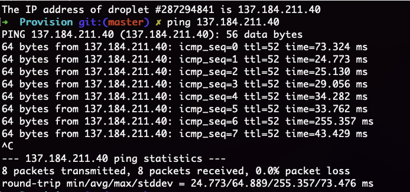
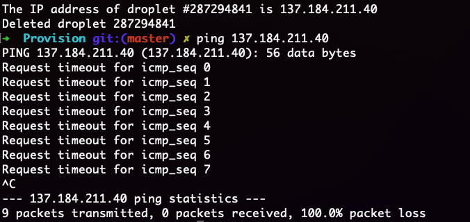

# Packaging and Provisioning

| Task     | Points |
| ------------- |:-------------:|
| [Building a Virtual Machine Image](https://github.ncsu.edu/CSC-DevOps-S22/HW2-xfang22-DevOps#-building-a-virtual-machine-image) | 70 | 
| [Provisioning Workshop](https://github.ncsu.edu/CSC-DevOps-S22/HW2-xfang22-DevOps#%EF%B8%8F-provisioning-workshop) | 20 |
| [Screencast](https://github.ncsu.edu/CSC-DevOps-S22/HW2-xfang22-DevOps#-screencast)  | 10 |

## 💿 Building a Virtual Machine Image
`git clone` this repo 
`cd` into the directory
then
```
npm i
npm link
# Build the custom docker image
p init
# Build rootfs, extract kernel, initrd and package as iso.
p build
```
P.S. Make sure all the .sh file is executable before first try.  
For example, 
```
chmod +x /lib/scripts/package-iso.sh
chmod 777 /my-vol/createVS.sh
```

After successful build, a `disk.img` and `jn.iso` will be in the `my-vol` folder.  
`cd` into `my-vol`, then run `./create.sh` to create the Virtual Machine.  

  

Open the VM from VirtualBox GUI
> Username: ubuntu  
> Password: ubuntu

```
# set up password to avoid using token
jupyter notebook password
# start jupyter notebook
jupyter notebook --allow-root --ip 0.0.0.0
```


Open your browser in the host and visit `127.0.0.1:8888`  
Run the following code snippet in the working Jupyter Notebook
```
import pandas as pd
import seaborn as sns
import matplotlib.pyplot as plt

titanic = pd.read_csv('/data/titanic.csv')

# Countplot
sns.catplot(x ="Sex", hue ="Survived",
kind ="count", data = titanic)
```

## ☁️ Provisioning Workshop
 
 link to the repo to see my code 📎 https://github.ncsu.edu/xfang22/Cloud-provision  

 * Ping the IP address of the droplet to make sure it is alive  
 

 * Ping it again when the droplet is deleted  
 


## 📹 Screencast
Link:   
📎 [Building a Virtual Machine Image](https://drive.google.com/file/d/1mGaQtfZfgq4GWLZUJNJzMApB8KtNggI2/view?usp=sharing)  
📎 [Provision Workshop](https://drive.google.com/file/d/1fts3txY4K5inFvnHPWvEa5Y1Fzx1yGmJ/view?usp=sharing)